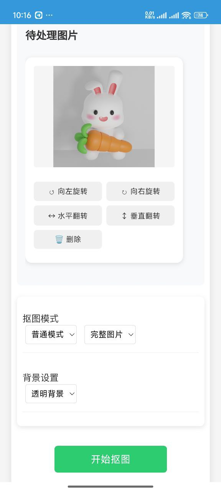

<div align="center">
  
  <h1>AI智能抠图工具</h1>
  <p><em>基于 <a href="https://github.com/danielgatis/rembg">Rembg</a> 的在线抠图工具</em></p>
  <hr>
</div>

一个基于Python和Flask的图片抠图工具,支持AI智能抠图和颜色抠图两种模式。
## 界面预览

### 电脑端
<div align="center">
  <p float="left">
    
    
  </p>
  <p float="left">  
    
    
  </p>
</div>

### 手机端
<div style="display: flex; overflow-x: auto; gap: 20px; padding: 20px 0;">
  
  
  
  
</div>


## 功能特点

- 支持批量处理多张图片
- 双模式抠图:
  - AI智能抠图(基于rembg)
  - 颜色抠图(基于颜色匹配)
- 可调节参数:
  - AI模式:前景/背景阈值、边缘模糊度
  - 颜色模式:目标颜色、颜色容差
- 支持透明背景或自定义背景色
- 支持图片旋转和翻转
- 支持多种图片格式(JPG、PNG)
- 简洁直观的Web界面
- 响应式设计,支持移动端访问
- 支持热重载配置文件
- 支持Windows和Linux环境变量动态更新

## 环境要求

- Python 3.1+
- 依赖包:
  - Rembg
  - Flask
  - Flask-cors
  - Pillow
  - Numpy
  - Python-dotenv
  - Onnxruntime

## 安装步骤

1. 克隆项目到本地
2. 安装依赖:
   ```bash
   pip install -r requirements.txt
   ```
3. 创建 `.env` 文件并配置以下参数:
   ```
   APP_PASSWORD=your_password_here  # 访问密码
   SALT=your_salt_here      # 密码加密盐值
   DEV_MODE=false          # 是否为开发模式
   ENABLE_AUTH=true        # 是否启用密码验证
   ```

4. 运行服务:
   ```bash
   python app.py
   ```

## 使用说明

1. 访问 `http://localhost:5000`
2. 如果启用了密码验证,输入访问密码
3. 选择需要处理的图片(支持多选)
4. 选择抠图模式:
   - AI智能抠图:适合复杂背景
   - 精细模式:适合需要更高精度的图片
   - 颜色抠图:适合纯色背景
5. 调整相关参数
6. 可以对图片进行以下预处理:
   - 旋转(左右90度)
   - 水平/垂直翻转
   - 删除不需要的图片
7. 点击"开始抠图"进行处理

## 安全特性

- 可选的密码验证功能
- Cookie认证机制
- 定期检查认证状态
- 密码加盐哈希存储

## 注意事项

- 建议在本地环境使用,未做大规模并发处理优化
- AI模式处理时间较长,请耐心等待
- 颜色抠图模式适合处理纯色背景图片
- 精细模式会消耗更多计算资源


## 环境变量热更新

### 如何在运行时更新环境变量

windows

```powershell
Invoke-WebRequest -Method POST -Uri http://localhost:5000/reload-config
```


linux

```bash
curl -X POST http://localhost:5000/reload-config
```

注意:
- 热更新不会中断当前的连接和处理中的任务
- 新的配置会在下一次请求时生效
- 建议在低负载时进行配置更新


